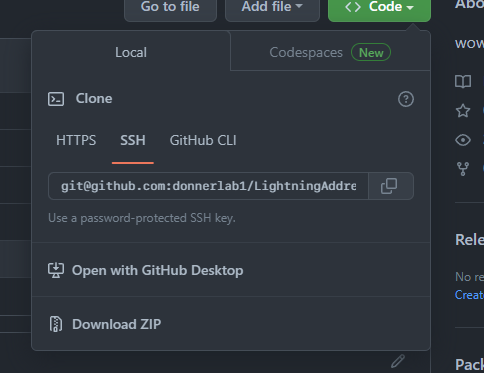
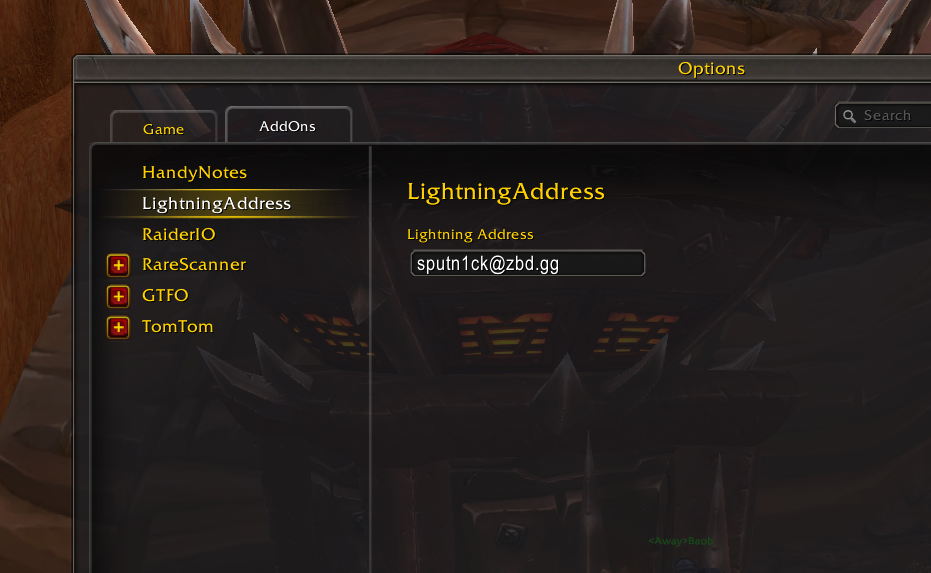
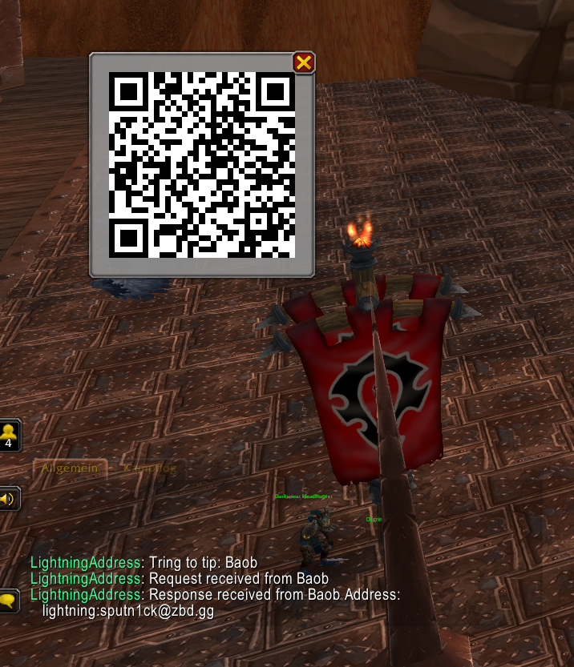

# LightningAddress

- Download zip and place into your wow addons folder: "_retail_/Interface/Addons"

- Rename the folder into "LightningAddress"
- Enter your lightning address in the "Addons/LightningAddress" option

- Select a player and type "/tip"
